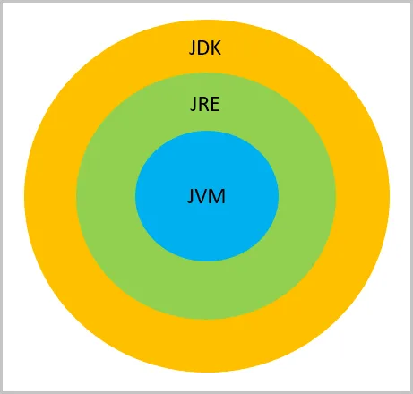
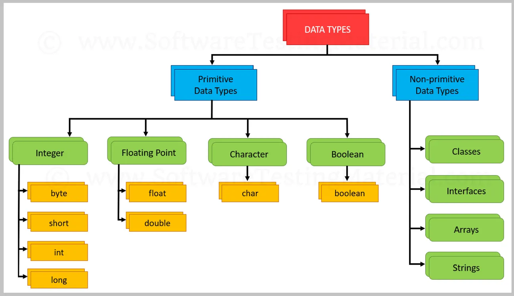
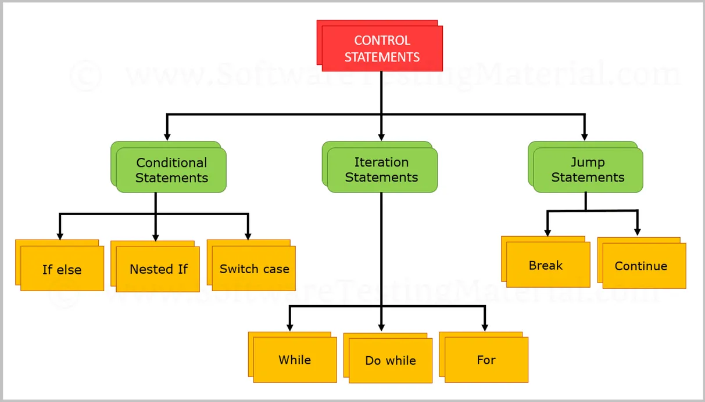

catalogue: java

#### Java 介绍

JAVA 于 1991 年由 Sun Microsystems 公司 的 James Gosling 开发，后来被Oracle收购。 它是一种简单的编程语言。 Java 使编写、编译和调试程序跨平台变得容易,而且它有助于创建可重用的代码和模块化程序。

下面是介绍JAVA入门到精通的步骤。

#### JDK, JRE and JVM:
我们需要理解这3个术语JDK, JRE and JVM，以及他们之间的区别。下面这张图是反应它们之间最基本关系。



##### 什么是JDK

JDK 全称是Java Development Kit,即Java开发包，它提供了编译、运行Java程序所需的各种工具和资源，包括Java编译器、Java运行时环境，以及常用的Java类库等。JAVA 开发者开发java程序必须安装JDK环境。

##### 什么是JRE 

JRE  全称是 Java Runtime Environment。Java运行环境，用于解释执行Java的字节码文件。普通用户而只需要安装 JRE（Java Runtime Environment）来运行 Java 程序。而程序开发者必须安装JDK来编译、调试程序。

##### JVM 

JVM(Java Virtual Mechinal)，Java虚拟机，是JRE的一部分。它是整个java实现跨平台的最核心的部分，负责解释执行字节码文件，是可运行java字节码文件的虚拟计算机。所有平台的上的JVM向编译器提供相同的接口，而编译器只需要面向虚拟机，生成虚拟机能识别的代码，然后由虚拟机来解释执行。

当使用Java编译器编译Java程序时，生成的是与平台无关的字节码，这些字节码只面向JVM。不同平台的JVM都是不同的，但它们都提供了相同的接口。JVM是Java程序跨平台的关键部分，只要为不同平台实现了相应的虚拟机，编译后的Java字节码就可以在该平台上运行。

##### 区别与联系

JDK 用于开发，JRE 用于运行java程序 ；如果只是运行Java程序，可以只安装JRE，无序安装JDK。
JDk包含JRE，JDK 和 JRE 中都包含 JVM。
JVM 是 java 编程语言的核心并且具有平台独立性。

##### Java 语法:
1. Java是大小写敏感的语言。例如: NAME 和 name  代表不同的变量或者对象
2. Java文件名和类名称保持一致
3. 类名以大写字母开头
4. 方法命名以小写开头
5. 每个语句都应以分号结尾
6. Java 程序执行从 main 方法作为入口开始 

```java
public static void main(String [] args){
 
System.out.println(“Learning Java from SoftwareTestingMaterial”);
//换行打印
System.out.println(“Learning Java from SoftwareTestingMaterial”);
}
```

#### jAVA数据类型:
java中的数据类型指定了可以存储在标识符中的值的大小和类型。有一下2种数据类型：
1. 原始数据类型(Primitive Data Type)
2. 非原始数据类型(Non-primitive Data Type)



##### 原始数据类型(Primitive Data Type)
有8种原始数据类型 例如 byte, short, int, long, float, double, char, and boolean.

byte, short, int & long – 存储数字类型
float, double – 存储有小数点数据
char – 存储字符
boolean – 存储true 或者 false

##### 非原始数据类型(Non-primitive Data Type)
非原始数据类型在接下来的教程中会有介绍。

#### JAVA操作运算符

1. 算术运算符 (+, –, *, /, %)
2. 赋值运算符 (=, +=, -=, *=, /=, %=)
3. 自增自减 (++, —)
4. 逻辑 (&&, ||, !)
5. 比较运算符 (==, !=, >, <, >=, <=)
6. 位操作符 (&, |, ^, ~, <<, >>)
7. 三元运算符

#### 控制流语句



##### 条件语句
1. if 语句
2. 嵌套 if 语句
3. if-else 语句
4. if-else-if 语句
5. Switch Case 语句


#### OOPS 概念:
OOPS 意思是面向对象编程. 在这个教程中, 我将介绍类、对象、构造函数、抽象、封装、继承、多态、接口等。 

#### 类:
类是创建对象的原型。 类包含变量（数据类型）和方法（函数）来描述对象的行为。

```java
class Class_Name{
member variables
methods
}
```
#### 对象：
对象是相关状态和行为结合体。 对象有两个特征，即状态和行为。

我们可以说对象是包含状态和行为的实体。

状态: 代表对象里值的类型和变量
行为: 代表对象里的方法

对象是类的实例。例如：
```java
class Computer{
String Maker;
int Model;
String Color;
void turnOn{
//statement(s)
}
void turnoff{
              //statement(s)
}
}
```

状态: Maker, Model, Color etc.,
行为: Turn on, Turn off etc.,

